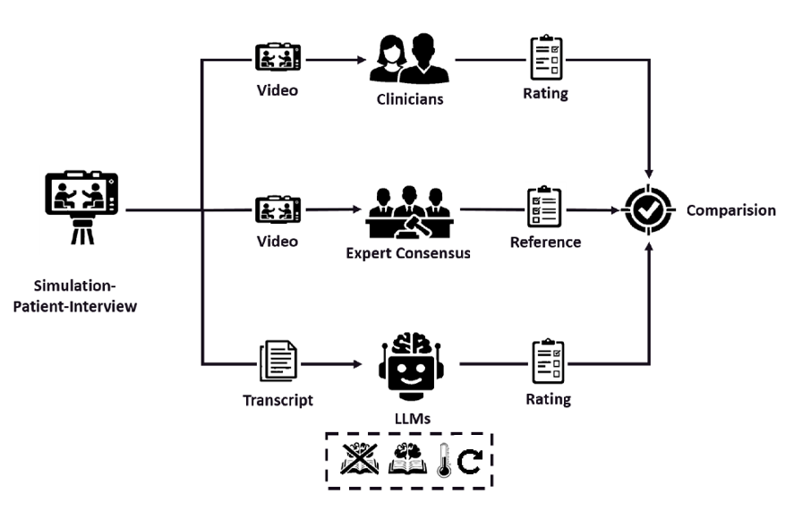

# Benchmarking Large Language Models Against Practicing Clinicians on Psychopathological Assessment

This repository contains code and data for evaluating large language models on psychopathology rating tasks and comparing model performance with practicing clinicians.

## Experimental Design
Simulated patient interviews assessed via three pathways: practicing clinicians (n=108), expert consensus panel (n=3 AMDP trainers), and LLMs (n=10 models). LLMs evaluated transcripts with and without AMDP-Definitions. All ratings compared against expert ground truth.



## Results Visualization Mentioned in Publication
Interactive visualizations comparing model performance with human ratings:

- **Mania**: https://42elenz.github.io/LLMs_psychopathologies/selection__error_rate_scatter_video_7.html
- **Depression**: https://42elenz.github.io/LLMs_psychopathologies/selection__error_rate_scatter_video_8.html
- **Schizophrenia**: https://42elenz.github.io/LLMs_psychopathologies/selection__error_rate_scatter_video_9.html

These interactive plots show:
- Model vs. reference vs. clinician rating errors
- Model reasoning (hover for details)

## Repository Structure

- `src/00_call_models.py`: Main script for LLM inference and rating generation
- `src/01_comparision_and_statistics.ipynb`: Analysis notebook containing all experiments and comparisons from the paper
- `data/`: Contains prompts, transcripts, and reference ratings
- `outputs/`: Generated model ratings and statistical analyses; under clinical_rating_sheets all ratings in a comprehensive way can be investigated
- `docs/`: Interactive visualizations
- `src/utils/model_config.py`: Model configuration and selection

## Reviewer Quick Start

If you only want to verify the published analyses (without running new API calls):

1. Install dependencies:

```bash
pip install -r requirements.txt
```

2. Open `src/01_comparision_and_statistics.ipynb`.
3. Run all notebook cells as provided.

The notebook is preconfigured to load the publication data.

If you want to run fresh inference with LLM APIs, follow the setup below.

## Setup Instructions

### 1. Environment Setup
Install dependencies from the project root:

```bash
pip install -r requirements.txt
```

### 2. API Keys Configuration
1. Navigate to `api_keys/` directory
2. Rename `.your_env` to `.env`
3. Add the keys you need:

```env
OPENAI_API_KEY=your_openai_key
ANTHROPIC_API_KEY=your_anthropic_key
GEMINI_API_KEY=your_gemini_key
MISTRAL_API_KEY=your_mistral_key
TOGETHER_API_KEY=your_together_key
```

Important:
- Keep the `.env` file in `api_keys/.env` (path is fixed in code).
- You only need keys for providers you actually use in `models_to_use`.
- Local `vllm` runs do not require a provider key.

### 3. Model Selection (`src/utils/model_config.py`)
Select models in `models_to_use` as tuples of `(api_family, model_name)`:

```python
models_to_use = [
    ("gemini", "gemini-2.5-flash"),
]
```

Supported `api_family` values and credential requirements:
- `openai` -> `OPENAI_API_KEY`
- `anthropic` -> `ANTHROPIC_API_KEY`
- `gemini` -> `GEMINI_API_KEY`
- `mistral` -> `MISTRAL_API_KEY`
- `open_source` (Together) -> `TOGETHER_API_KEY`
- `vllm` (local server) -> no external API key required

## Running Inference (`src/00_call_models.py`)

Example run (single model, single transcript set):

```bash
cd src
python 00_call_models.py \
  --outer_runs 1 \
  --number_of_definitions 10 \
  --temperature 0.0 \
  --prompt_language german \
  --transcript_dir ../data/02_transcripts_example/
```

Main arguments:
- `--outer_runs`: number of repeated runs per transcript (default: `1`)
- `--number_of_definitions`: number of AMDP definitions injected per chunk (default: `10`; use `0` for basic prompt only)
- `--temperature`: generation temperature (default: `0.0`)
- `--prompt_language`: `german` or `english`
- `--prompt_dir`: prompt files folder (default: `../data/01_prompts/`)
- `--transcript_dir`: transcript folder (default: `../data/02_transcripts/`)
- `--reference_file`: reference ratings CSV (default: `../data/00_ratings/reference.csv`)
- `--output_dir`: output CSV folder (default: `../outputs/AI_ratings/`)
- `--vllm_url`: local vLLM OpenAI-compatible endpoint (default: `http://localhost:8000/v1`)

Generated files:
- Combined ratings CSV: `outputs/AI_ratings/all_runs_combined_definitions_<...>.csv`
- Raw responses per chunk: `src/raw_responses/`
- Error dumps on failed parsing/API responses: `src/parsing_errors/`

## How API Calls Work (Important)

`src/00_call_models.py` delegates all provider-specific logic to `src/utils/helper_inference.py`.

### Runtime Flow
1. Parse CLI arguments.
2. Set `VLLM_BASE_URL` from `--vllm_url`.
3. Initialize only the required clients based on `models_to_use`.
4. Load prompt templates, definitions, transcript files, and reference schema.
5. Split definitions into prompt chunks (`number_of_definitions` controls chunk size).
6. For each model x transcript x run x chunk:
   - Call the provider API
   - Save raw response
   - Parse JSON into rating columns
7. Merge chunk-wise outputs into one row per run and save final CSV.

### Provider-Specific Call Behavior
- OpenAI (`api_family="openai"`)
  - `gpt-4-turbo`: uses `chat.completions.create(..., response_format={"type":"json_object"})`
  - newer models (e.g., `gpt-5.1`): uses `responses.parse(..., text_format=Psychopathologies)` for structured parsing

- Gemini (`api_family="gemini"`)
  - Uses `generate_content` with `response_mime_type="application/json"` and explicit schema (`response_schema`)

- Anthropic (`api_family="anthropic"`)
  - Uses `beta.messages.create` with `output_format={"type":"json_schema", ...}`

- Mistral (`api_family="mistral"`)
  - Uses chat completion endpoint with `response_format={"type":"json_object"}`

- Together / open-source (`api_family="open_source"`)
  - Uses Together chat completions with JSON schema response format
  - Max output tokens are queried dynamically from Together model metadata with fallbacks

- Local vLLM (`api_family="vllm"`)
  - Uses OpenAI-compatible chat endpoint at `--vllm_url`
  - Structured output enforced via `extra_body={"guided_json": schema}`

### Reliability and Error Handling
- Each chunk call uses retry with exponential backoff for transient errors (e.g., 429, 503, timeout).
- Default retry pattern: up to 5 attempts with delays 20s, 40s, 80s, ...
- If a chunk fails to parse or repeatedly fails API calls, raw output is saved to `src/parsing_errors/` and that model run is stopped.

### Practical Tips
- Start with one model and `--outer_runs 1` to validate your setup.
- Use `--number_of_definitions 0` for a fast smoke test.
- For full paper-like runs, switch transcript directory to `../data/02_transcripts/` and enable all desired models in `model_config.py`.

## Analyze Results
If you want to inspect the publication analyses directly, run the notebook as-is (it loads the publication data by default).

1. Open `src/01_comparision_and_statistics.ipynb`
2. Optionally point to your newly generated CSV in `outputs/AI_ratings/`
3. Run all cells

The notebook contains:
- Statistical comparisons from the paper
- Performance metric calculations
- Export tables written to `outputs/tables/`


## Data Description

- **Prompts** (`data/01_prompts/`): GRASCEF scale definitions and rating instructions in German/English
- **Transcripts** (`data/02_transcripts/`): Patient interview transcripts for Mania, Depression, and Schizophrenia cases
- **Reference Ratings** (`data/00_ratings/reference.csv`): Expert consensus ratings used as ground truth
- **Human Ratings** (`data/00_ratings/human_master.csv`): Individual clinician ratings for comparison
- **R Analyses**: The R models and their code can be found in `src/R_analyses/`

## Notes for Reviewers

- The provided example runs inference on a single transcript (Mania) with one model for demonstration
- To reproduce full paper-style runs, add the required models in `src/utils/model_config.py` and ensure corresponding API keys are set
- The analysis notebook (`01_comparision_and_statistics.ipynb`) contains all statistical tests and visualizations from the paper
- Raw outputs are preserved for full reproducibility and error analysis
- in outputs/clinican_rating_sheets all ratings can be found in a comprehensive way to check rating behaviour of each clinician
- Together AI API-Endpoints can vary due to time. You can check on their website which models can be inferenced at the moment (newest open source models https://www.together.ai/models). 
